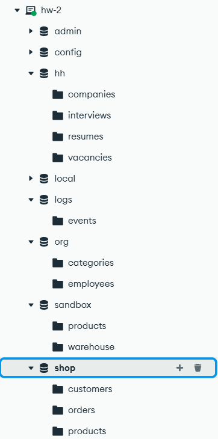
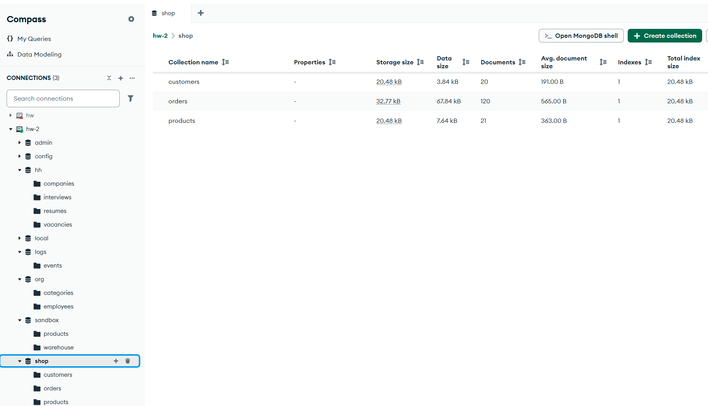
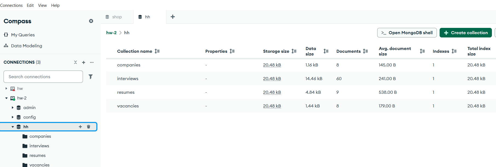
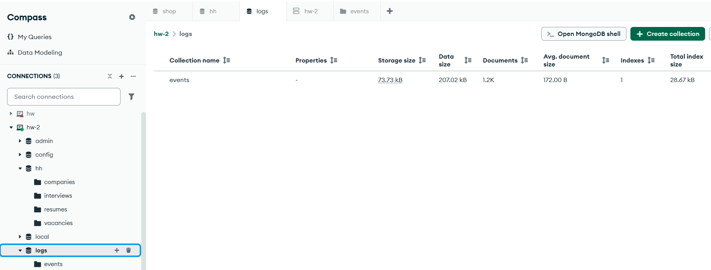
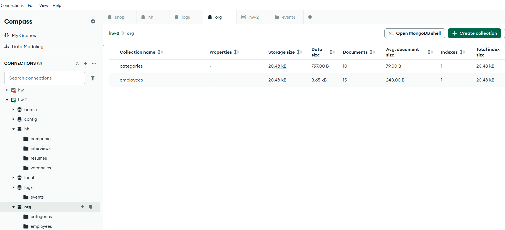

# Домашнее задание № 2 · модуль 1 справочника и учебные базы

## Отчет

| База | Должно быть | У меня |
|---|---|---|
| `shop` | products 21 · orders 120 · customers 20 | 21 · 120 · 20 |
| `hh` | resumes 9 · vacancies 8 · companies 8 · interviews 60 | 9 · 8 · 8 · 60 |
| `logs` | events 1200 | 1200 |
| `org` | employees 15 · categories 10 | 15 · 10 |

## Скриншоты

