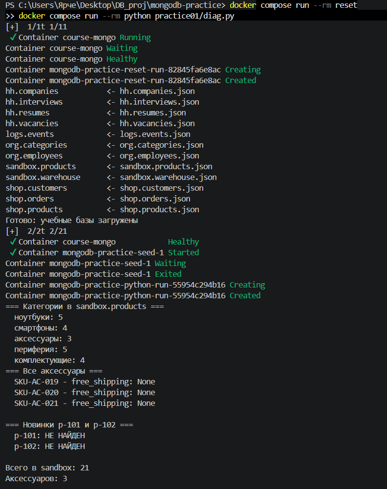
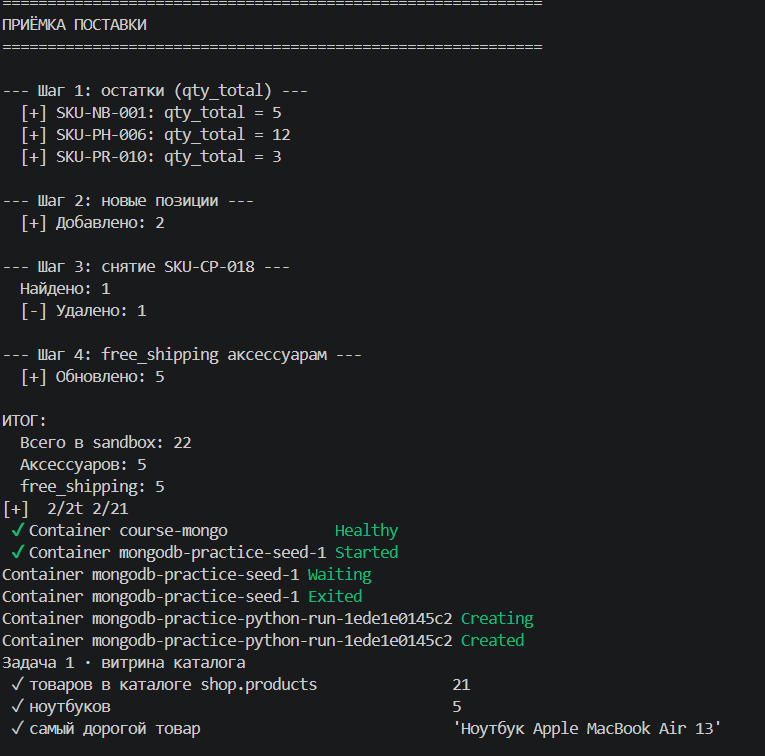
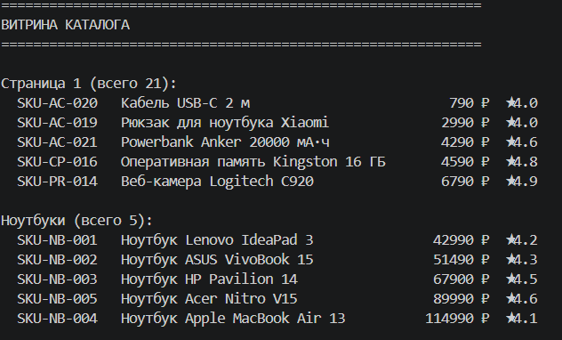
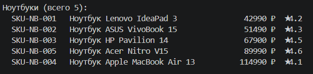
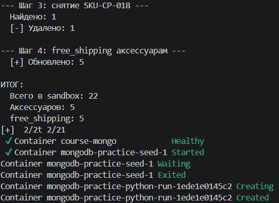
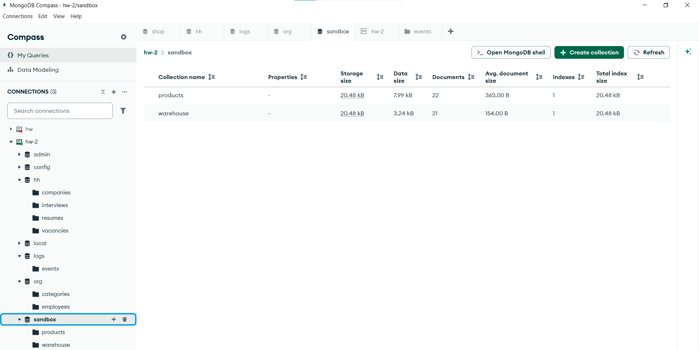
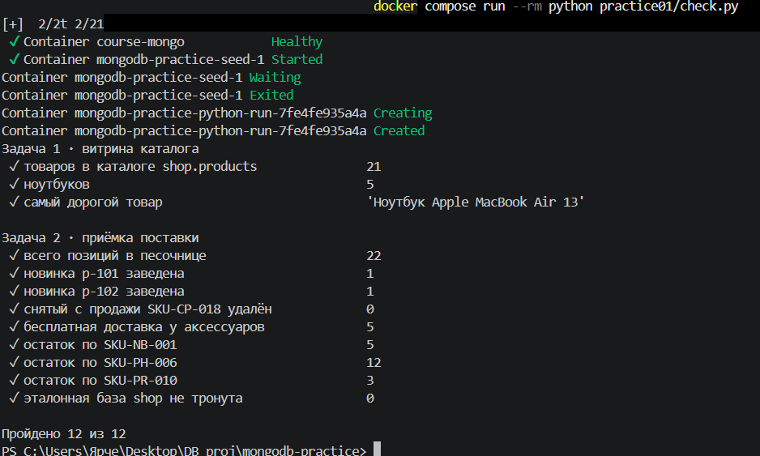

# Домашнее задание № 3 · «Каталог товаров»

## Отчёт

**ФИО:** Вакула Ярослав Гуфронович  
**Группа:** 11/3-РПО-24/1
**Дата:** 17.09.2026

### Среда выполнения

- ОС: Windows 10
- Язык и версия: Python 3.12 (в Docker)
- MongoDB / Compass: MongoDB 7 (контейнер `course-mongo`), Compass 1.x
- База данных: `sandbox`
- Коллекция: `products`
- Команда запуска: `docker compose run --rm python practice01/solution.py`

### Результаты

Какие товары созданы или загружены? Какие операции выполнены? Что вернул поиск?

Загружены учебные данные: 21 товар в базе `shop` и её копия в `sandbox`.
Витрина возвращает страницу каталога с сортировкой по цене и артикулу
и постраничной навигацией; фильтр по категории «ноутбуки» возвращает 5
товаров (SKU-NB-001…SKU-NB-005, от 42 990 до 114 990 ₽).

В приёмке поставки выполнены четыре операции:
1. Трём артикулам выставлен `qty_total`: SKU-NB-001 → 5, SKU-PH-006 → 12,
   SKU-PR-010 → 3.
2. Заведены две новые позиции: `p-101` (SKU-AC-101, чехол) и `p-102`
   (SKU-AC-099, мышь) — обе в категории «аксессуары».
3. Снят с продажи SKU-CP-018 (удалён один документ).
4. Всем аксессуарам проставлен `free_shipping: true` — обновлено 5
   документов.

Итог: в `sandbox.products` 22 товара, аксессуаров — 5, из них
с бесплатной доставкой — 5. База `shop` не тронута: там по-прежнему
21 товар и 0 документов с `free_shipping`.

### Скриншоты

1. Запуск: 
2. Создание товаров: 
3. Каталог: 
4. Поиск: 
5. Изменение/удаление: 
6. Проверка в базе: 
7. Проверка в Python: 

### Ответы на вопросы

Ответьте самостоятельно по 3–5 предложений.

1. Какие поля есть у документа товара? Какие поля должны иметь числовой тип и почему цену и количество нельзя хранить строками?

У документа товара есть поля _id (строка), sku (строка), title (строка), brand (строка), category (строка), price (число), specs (массив строк), stock (массив объектов {warehouse, qty}), qty_total (число), rating (число), reviews (число), added (дата), а у аксессуаров ещё free_shipping (булево). Числовой тип должны иметь price, qty_total, rating, reviews и stock.*.qty.

Цену и количество нельзя хранить строками по двум причинам. Во-первых, MongoDB сравнивает строки по символам: строка "100" считается меньше строки "90", хотя число 100 больше 90, — значит, сортировка по цене и фильтр $gt будут работать неправильно. Во-вторых, арифметические операторы вроде $inc работают только с числами; если stock — строка, $inc упадёт с ошибкой Cannot apply $inc to a value of non-numeric type, что мы и увидели, когда сначала попытались прибавить остаток к массиву объектов как к числу.

2. Чем обычное чтение коллекции отличается от поиска по условию? Приведите пример запроса или фрагмента кода из своей работы.

Обычное чтение (find({})) возвращает все документы коллекции. Поиск по условию (find(query)) возвращает только те, что удовлетворяют фильтру: например, {"category": "ноутбуки"} вернёт 5 документов из 21.

В моей работе функция catalog_page(category=None, page=1, limit=5) сначала формирует фильтр:

''' python
query = {}
if category:
    query["category"] = category
'''
Затем фильтр передаётся в shop_products.find(query, projection) вместе с сортировкой и пагинацией. Без категории query пустой, и запрос возвращает весь каталог (21 товар). С category="ноутбуки" — только 5 ноутбуков. Общее число документов под фильтром считает count_documents(query) на стороне сервера, а не len(list(cursor)) на клиенте: на больших коллекциях это экономит передачу данных.

3. Как вы проверили, что операция действительно изменила данные в MongoDB, а не только текст в интерфейсе программы?

Есть два уровня проверки. Во-первых, practice01/check.py — независимый скрипт, который не запускает мой код, а смотрит на состояние базы sandbox.products после работы и сверяет его с ожиданиями: 22 документа всего, p-101 и p-102 на месте, SKU-CP-018 удалён, 5 аксессуаров с free_shipping, qty_total равны 5, 12 и 3 у трёх SKU, а в базе shop поле free_shipping не появилось. Он выводит «Пройдено 12 из 12» — значит, данные в MongoDB действительно изменились так, как требует задание.

Во-вторых, я проверил базу вручную: через mongosh выполнил db.getSiblingDB('sandbox').products.countDocuments({free_shipping: true}) и получил 5; через Compass открыл коллекцию sandbox.products и увидел 22 документа и поле qty_total: 5 у SKU-NB-001. Если бы изменения были только «на экране программы», ни check.py, ни Compass этого не показали бы.

### Вывод

Я научился подключаться к MongoDB из Python-скрипта, читать каталог
с фильтром, сортировкой и пагинацией, а также выполнять изменения данных
через `update_one`, `update_many`, `insert_many` и `delete_many`.
Программа запускается одной командой `docker compose run --rm python
practice01/solution.py` и подключается к MongoDB на `localhost:27017`.
В MongoDB проверено: в `sandbox.products` 22 документа, у трёх артикулов
выставлено поле `qty_total`, добавлены позиции `p-101` и `p-102`, удалён
`SKU-CP-018`, всем пяти аксессуарам проставлен `free_shipping`, а учебная
база `shop` осталась нетронутой.

